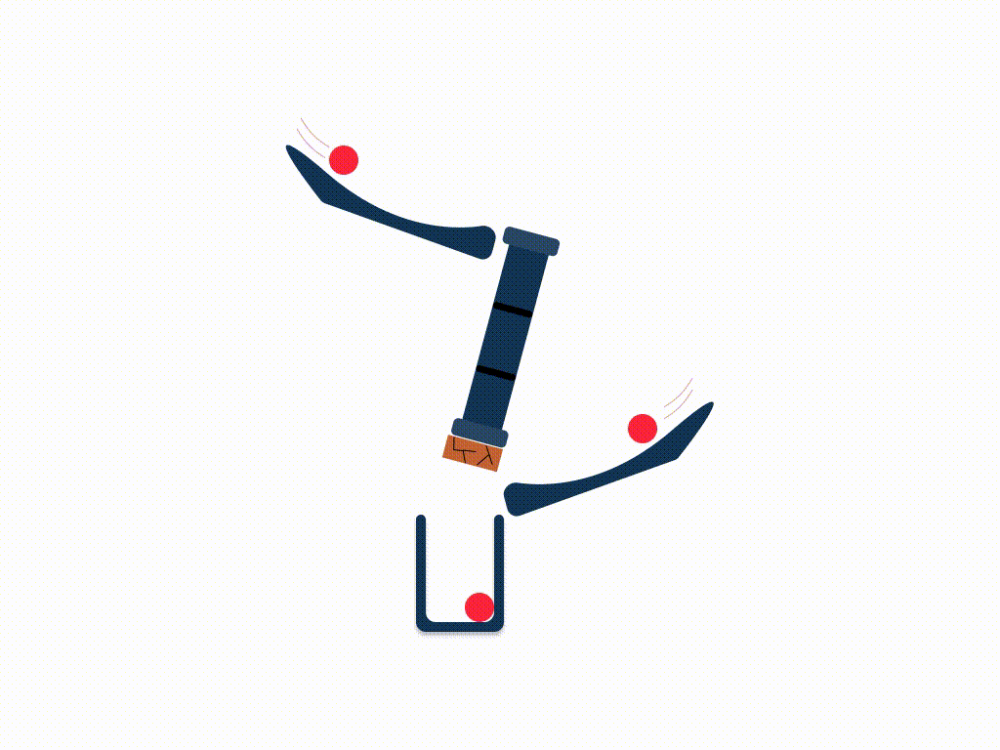

# tawazi
<!--Python badges -->
[](https://www.python.org/)
[](http://mypy-lang.org/)
[](https://www.codefactor.io/repository/github/mindee/tawazi)
[](https://pypi.org/project/tawazi/)

<!--Tawazi Badge-->


## Introduction

<!-- TODO: put a link explaining what a DAG is-->

<!-- TODO: document that if you want to run DAG in a sync context, the DAG should be sync, if you want to run it in a async context, the DAG should be async-->

[Tawazi](https://pypi.org/project/tawazi/) facilitates **parallel** execution of functions using a [DAG](https://en.wikipedia.org/wiki/Directed_acyclic_graph) dependency structure.

### Explanation

Consider the function `f` that depends on the function `g` and `h`:
```python
def g():
    print("g")
    return "g"
def h():
    print("h")
    return "h"
def f(g_var, h_var):
    print("received", g_var, h_var)
    print("f")
    return "f"

def main():
    f(g(), h())

main()
```
The [DAG](https://en.wikipedia.org/wiki/Directed_acyclic_graph) described in `main` can be accelerated if `g` and `h` are executed in parallel. This is what [Tawazi](https://pypi.org/project/tawazi/) does by adding a decorator to the functions `g`, `h`, `f`, and `main`:

```python
from tawazi import dag, xn
@xn
def g():
    print("g")
    return "g"
@xn
def h():
    print("h")
    return "h"
@xn
def f(g_var, h_var):
    print("received", g_var, h_var)
    print("f")
    return "f"
@dag(max_concurrency=2)
def main():
    f(g(), h())

main()
```
The total execution time of `main()` is **1 second instead of 2** which proves that the `g` and `h` have run in parallel, you can measure the speed up in the previous code:
```python
from time import sleep, time
from tawazi import dag, xn
@xn
def g():
    sleep(1)
    print("g")
    return "g"
@xn
def h():
    sleep(1)
    print("h")
    return "h"
@xn
def f(g_var, h_var):
    print("received", g_var, h_var)
    print("f")
    return "f"

@dag(max_concurrency=2)
def main():
    f(g(), h())

start = time()
main()
end = time()
print("time taken", end - start)
# h
# g
# received g h
# f
# time taken 1.004307508468628
```

### Features

This library satisfies the following:
* robust, well tested
* lightweight
* Thread Safe
* Few dependencies
* Legacy Python versions support (in the future)
* MyPy compatible
* Many Python implementations support (in the future)

In [Tawazi](https://pypi.org/project/tawazi/), a computation sequence is referred to as `DAG`. The functions invoked inside the computation sequence are referred to as `ExecNode`s.

Current features are:
* Specifying the number of "Threads" that the `DAG` uses
* setup `ExecNode`s: These nodes only run once per DAG instance
* debug `ExecNode`s: These are nodes that run only if `RUN_DEBUG_NODES` environment variable is set
* running a subgraph of the `DAG` instance
* Excluding an `ExecNode` from running
* caching the results of the execution of a `DAG` for faster subsequent execution
* Priority Choice of each `ExecNode` for fine control of execution order
* Per `ExecNode` choice of parallelization (i.e. An `ExecNode` is allowed to run in parallel with other `ExecNode`s or not)
* and more!

### Documentation
You can find the documentation here: [Tawazi](https://mindee.github.io/tawazi/).

In [this blog](https://blog.mindee.com/directed-acyclic-graph-dag-scheduler-library/) we also talk about the purpose of using `Tawazi` in more detail.

**Note**: The library is still at an [advanced state of development](#future-developments). Breaking changes might happen on the minor version (v0.Minor.Patch). Please pin [Tawazi](https://pypi.org/project/tawazi/) to the __Minor Version__. Your contributions are highly welcomed.

## Name explanation
The libraries name is inspired from the arabic word تَوَازٍ which means parallel.

## Building the doc
Only the latest version's documentation is hosted. 

If you want to check the documentation of a previous version please checkout the corresponding release, install the required packages and run: `mkdocs serve`


## Developer mode
```sh
pip install --upgrade pip
pip install flit wheel

cd tawazi
flit install -s --deps develop
```

## Future developments
__This library is still in development. Breaking changes are expected.__
